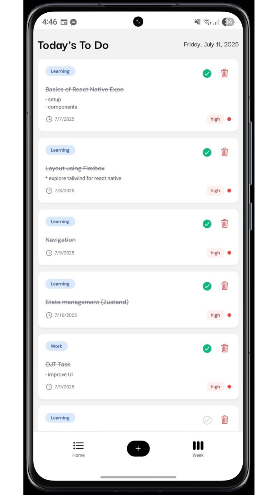
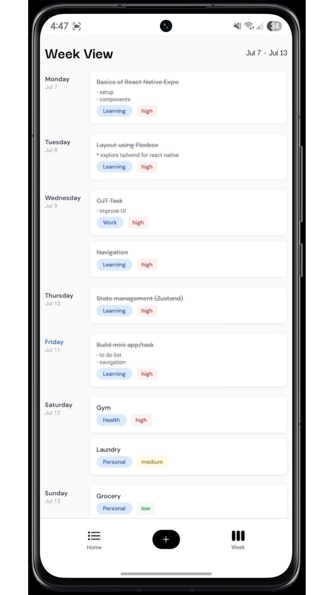
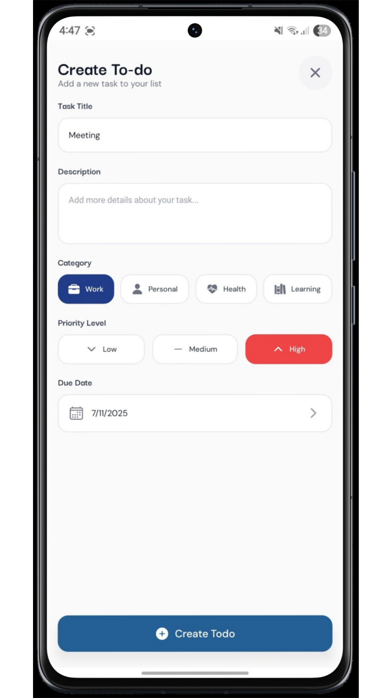

# Simple Front-end State-based Todo App in React Native

<p align="center">
  
  
  
</p>

A clean and intuitive todo application built with React Native and Expo, featuring a unique straightforward week view that most todo apps lack.

## The Problem

Most todo applications don't provide a straightforward week view, making it difficult to plan and visualize tasks across an entire week. This app solves that problem by offering both a daily view and a comprehensive week view that organizes your todos by due dates.

## Features

### 📱 Core Features
- **Clean Daily View**: See all your todos for today in a simple, organized list
- **Week View**: Unique week-by-week layout showing todos organized by their due dates
- **Add Todos**: Quick todo creation with detailed form including:
  - Task title and description
  - Category selection (Work, Personal, Health, Learning)
  - Priority levels (High, Medium, Low)
  - Due date selection
- **Todo Management**: Mark todos as complete and delete tasks (soon, edit details)

### Future Features
- Editing details
- Settings
- Backend Integration

## Tech Stack

- **React Native** with Expo
- **TypeScript**
- **Zustand** for state management
- **NativeWind** for styling (Tailwind CSS)
- **Expo Router** for navigation

## Setup

### Prerequisites
- Node.js (v16 or higher)
- npm or pnpm
- Expo CLI

### Installation

1. Clone the repository:
```bash
git clone <repository-url>
cd simple-todo
```

2. Install dependencies:
```bash
pnpm install
# or
npm install
```

3. Start the development server:
```bash
npx expo start
```

4. Run on your device:
   - Scan the QR code with Expo Go app (iOS/Android)
   - Or press `i` for iOS simulator
   - Or press `a` for Android emulator

## Usage

### Creating a Todo
1. Tap the **+** button in the bottom navigation
2. Fill in the task details:
   - **Title**: What needs to be done?
   - **Description**: Additional details (optional)
   - **Category**: Work, Personal, Health, or Learning
   - **Priority**: High, Medium, or Low
   - **Due Date**: When should it be completed?
3. Tap **Create Todo**

### Managing Todos
- **Complete**: Tap the checkmark icon to mark as complete
- **Delete**: Tap the trash icon to remove a todo
- **View**: Switch between Daily and Week views using bottom navigation

### Week View
- Navigate to the Week tab to see your todos organized by days
- Each day shows:
  - Day name and date
  - All todos due that day
  - Visual indicators for categories and priorities
  - Empty state for days without tasks

## Customization

### Adding New Categories
Edit the category array in [`components/tabs.tsx`](components/tabs.tsx):
```tsx
{ name: 'NewCategory', icon: 'icon-name', color: 'bg-color-class' }
```

### Modifying Fonts
Add new fonts in [`app/_layout.tsx`](app/_layout.tsx) and update the font loading function.

### Styling
Modify styles using NativeWind classes or update [`global.css`](global.css) for global changes.

## Contributing

1. Fork the repository
2. Create your feature branch (`git checkout -b feature/amazing-feature`)
3. Commit your changes (`git commit -m 'Add some amazing feature'`)
4. Push to the branch (`git push origin feature/amazing-feature`)
5. Open a Pull Request

## License

This project is licensed under the MIT License - see the LICENSE file for details.

## Acknowledgments

- Built with Expo and React Native
- Typography using DM Sans and Darker Grotesque fonts
- Initial assignment for Codebility
